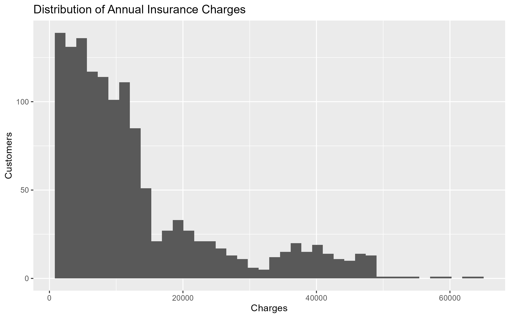
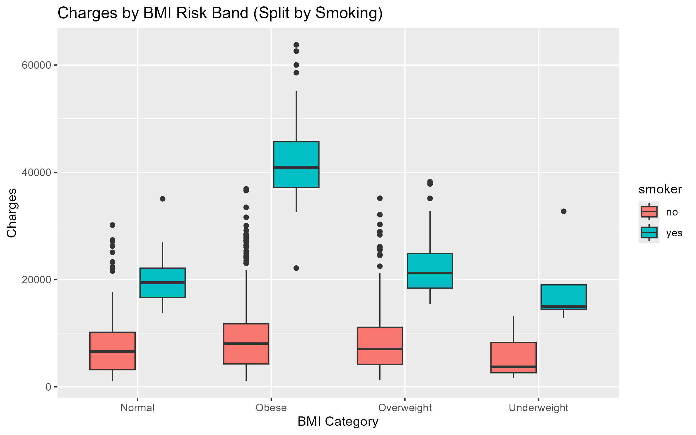
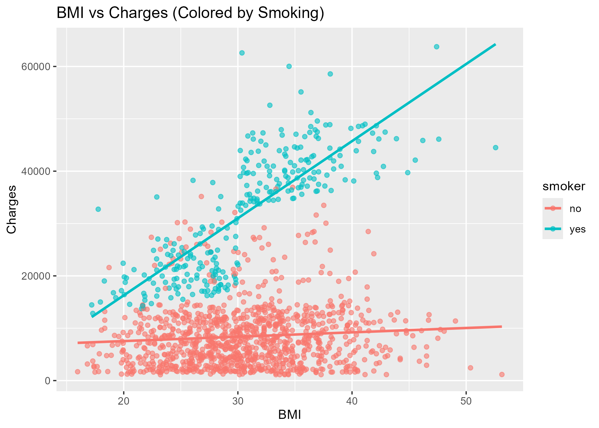
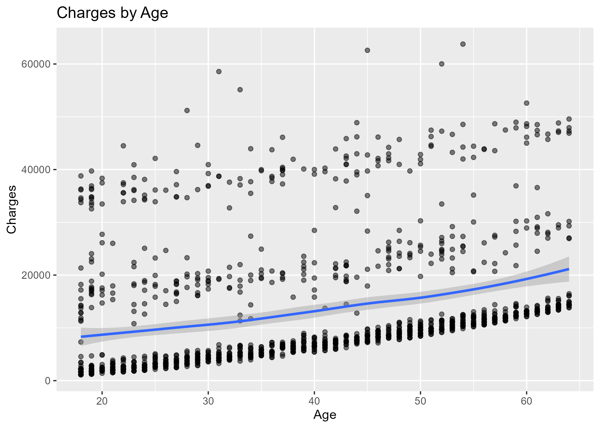
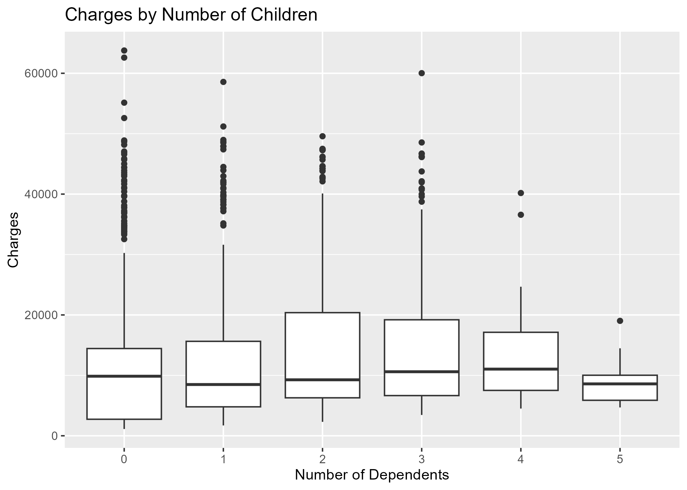
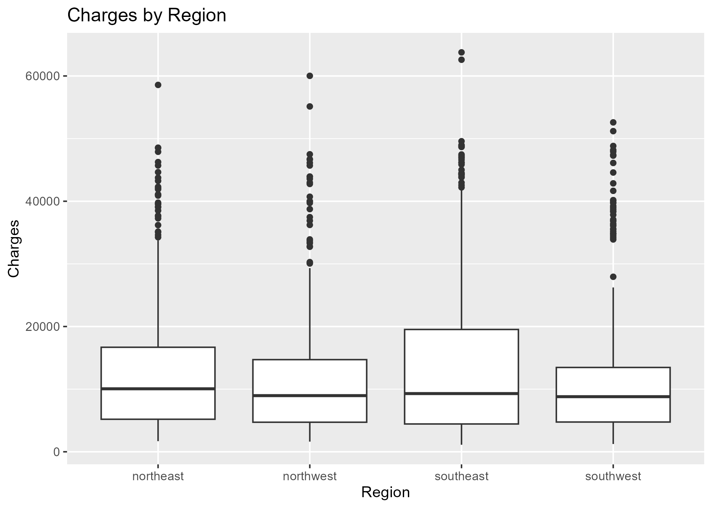
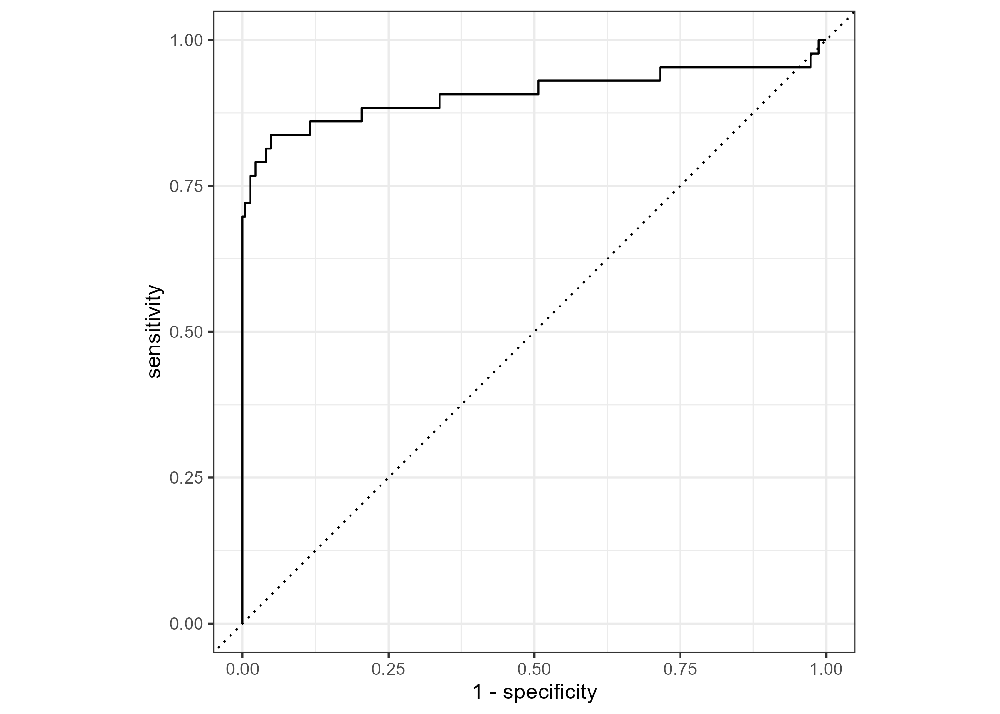
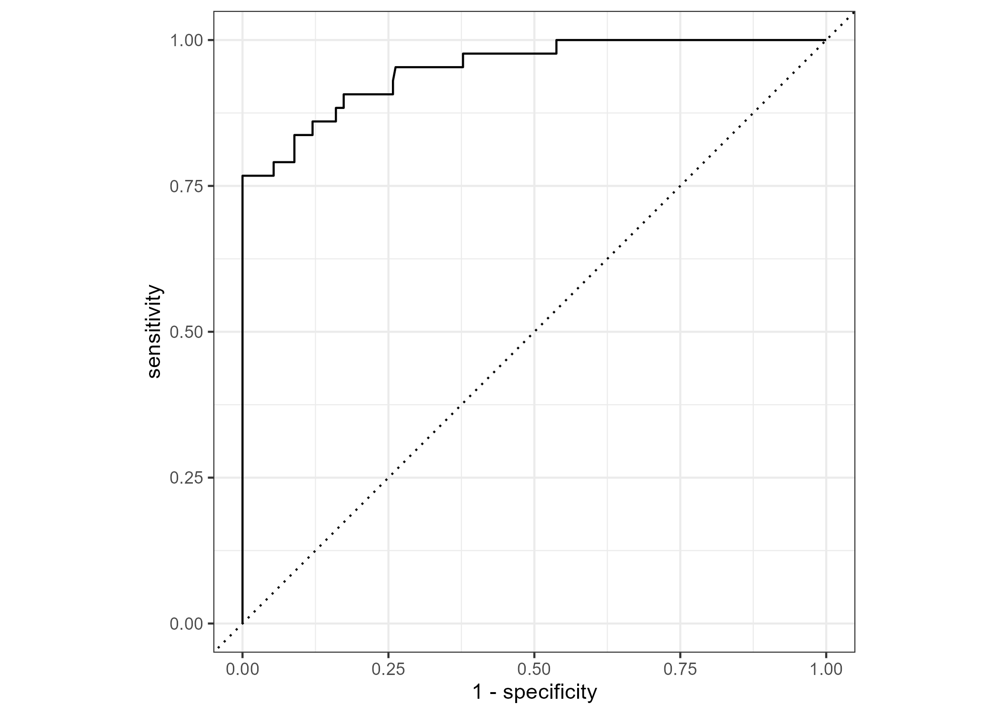
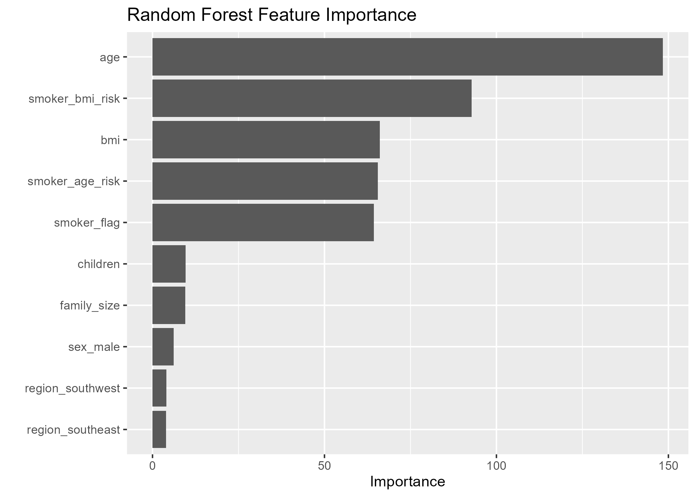

# Insurance Risk Analytics — R

## Business Question  
Which factors drive annual health insurance charges, and how can we identify **high-risk policyholders** using data-driven modeling?

---

## Dataset  
**US Health Insurance Dataset (Kaggle, n = 1,338)**  

Variables:

- `age`
- `sex`
- `bmi`
- `children`
- `smoker`
- `region`
- `charges` *(target variable)*

---

## Analytical Workflow

### 1️⃣ Exploratory Data Analysis (EDA)
Visualized the distribution of healthcare costs and assessed individual risk drivers across demographics and lifestyle factors.

---

### Charge Distribution

- Annual charges exhibit a **highly right-skewed distribution**.
- A small subset of customers drives the majority of total costs, underscoring the importance of identifying the **high-risk tail**.

---

### Smoking Status — Primary Cost Driver

- Smoking produces **4–5× higher median insurance charges** compared to non-smokers.
- Smoking also explains most extreme high-cost outliers.

---

### BMI Risk Bands (Split by Smoking)

- **BMI compounds risk among smokers**, pushing costs dramatically upward.
- Among non-smokers, BMI alone has a modest influence.
- Demonstrates strong **lifestyle interaction effects**.

---

### BMI vs Charges (Interaction Visualization)

- Linear relationship between BMI and charges exists primarily for smokers.
- Slopes diverge significantly between smoker vs non-smoker populations.

---

### Age Trends

- Charges rise steadily with age.
- Cost variability accelerates in later life stages.
- Age remains a consistent actuarial driver.

---

### Dependents

- Family size shows **high variance but weak central trend**.
- Dependents provide limited standalone predictive value.

---

### Geographic Region

- Regional effects exist but are **secondary to lifestyle risk factors**.
- Geography contributes minor variance compared to smoking, BMI, and age.

---

---

## Feature Engineering

To capture compounding risk:

- **Smoker × BMI interaction**
- **Smoker × Age interaction**
- Family size feature
- BMI risk categories
- Age group buckets

---

---

## Risk Tier Creation

Annual charges were segmented into underwriting tiers:

| Tier | Description |
|------|--------------|
| **Low Risk** | Bottom 60% of customers |
| **Medium Risk** | Next 25% |
| **High Risk** | Top 15% highest-cost customers |

This framing mirrors insurer focus on loss concentration in the cost tail.

---

---

## Predictive Modeling

Two classification models were trained:

| Model | Purpose |
|------|------------|
| **Logistic Regression** | Baseline classification |
| **Random Forest** | Ensemble uplift model |

Performance evaluated using:

- Confusion matrices
- **ROC–AUC for High-Risk detection**

---

---

### Logistic Regression ROC

---

### Random Forest ROC

✅ The Random Forest model demonstrated superior **High-Risk detection performance**, improving sensitivity while maintaining low false-positive rates.

---

---

## Feature Importance — Random Forest

Top predictors ranked by contribution:

1. **Age**
2. **Smoker × BMI interaction**
3. **BMI**
4. **Smoker × Age interaction**
5. **Smoker indicator**

Lifestyle factors vastly outweigh demographic or geographic drivers.

---

---

## Final Business Conclusions

- **Smoking status is the single strongest cost driver** across the population.
- **BMI amplifies financial risk primarily among smokers**, validating the need for interaction modeling.
- **Age is a consistent actuarial predictor** but secondary to lifestyle risk.
- **Geography and dependents contribute minor variance** once behavioral risks are accounted for.
- Ensemble modeling materially improves underwriting classification accuracy for **high-risk customer identification**.

---

---

## Tools & Methods

- **R**: `tidyverse`, `tidymodels`, `yardstick`, `ranger`, `vip`
- Feature engineering & interaction modeling
- Logistic & Random Forest classification
- ROC-AUC performance validation
- Explainable AI via feature importance analysis

---

---

## Author

**Vishal Kurup**  
Data Analyst / Analytics Engineer
